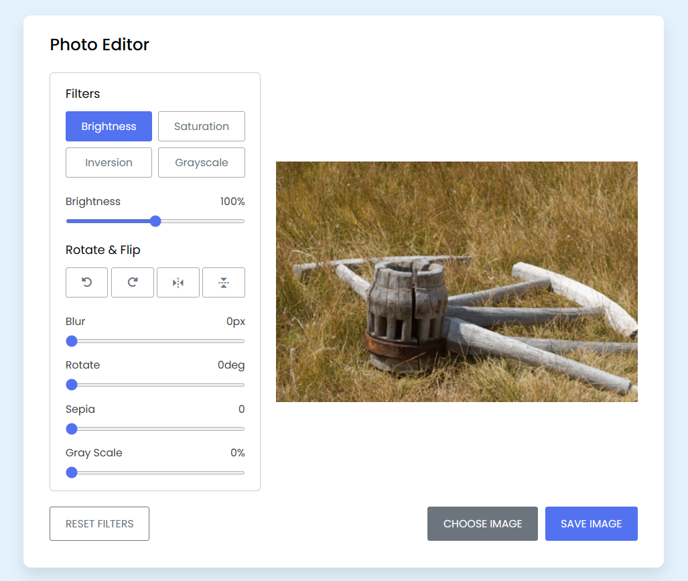

# Image Editor JavaScript 🎨

This project is a simple image editor built using HTML, CSS, and JavaScript. It allows users to apply various filters and transformations to images in real-time within the browser. The editor provides options to adjust brightness, saturation, inversion, grayscale, blur, rotation, horizontal scaling, vertical scaling, sepia effect, and grayscale intensity. The project uses external libraries like Boxicons and Font Awesome for icons.

## Features 🌟

- **Filters**: Users can apply different filters to the image, including brightness, saturation, inversion, and grayscale. Each filter can be adjusted using a slider.
- **Blur**: Users can apply a blur effect to the image using a slider to control the blur intensity.
- **Rotation**: Users can rotate the image left or right by 90 degrees or flip it horizontally or vertically.
- **Sepia Effect**: Users can apply a sepia effect to the image using a slider to control the intensity.
- **Grayscale Intensity**: Users can adjust the intensity of the grayscale effect on the image.
- **Choose Image**: Users can select an image from their device to edit.
- **Save Image**: Users can save the edited image after applying filters and transformations.
- **Reset Filters**: Users can reset all applied filters and transformations to their default values.

## Usage 🚀

1. Open the `index.html` file in a web browser.
2. Click the "Choose Image" button to select an image from your device.
3. Once the image is loaded, you can apply filters and transformations:
   - Use the buttons under "Filters" to apply different filters. The active filter will be highlighted.
   - Adjust the sliders to modify the intensity of the selected filter.
   - Use the buttons under "Rotate & Flip" to rotate or flip the image.
   - Use the sliders to adjust the blur intensity, rotation angle, sepia effect, and grayscale intensity.
4. To reset all filters and transformations, click the "Reset Filters" button.
5. To save the edited image, click the "Save Image" button.

## Libraries Used 📚

- [Boxicons](https://boxicons.com/): Used for icons in the UI.
- [Font Awesome](https://fontawesome.com/): Used for icons in the UI.

---

  
Enjoy editing images with this simple and intuitive image editor!

  

